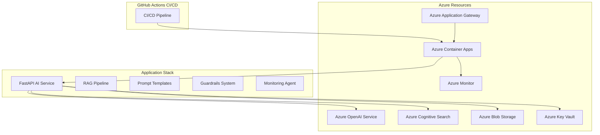

# Azure AI Infrastructure Platform

[](https://github.com/syabdulr/Azure-AI-Infrastructure-Platform/actions)
|[](https://github.com/syabdulr/Azure-AI-Infrastructure-Platform/actions/workflows/docker.yml)
|[](https://opensource.org/licenses/MIT)
|[](https://www.python.org/downloads/)

A production-grade AI platform deployed on Azure with full infrastructure-as-code, monitoring, and operational capabilities. Built for enterprises that need to deploy AI workloads at scale with security, scalability, and cost efficiency.

## 🎯 Overview

The Azure AI Infrastructure Platform demonstrates a complete AI platform engineering approach—from code to cloud deployment with comprehensive observability. This is not just an AI demo; it's a production-ready system that showcases how to operationalize AI workloads in enterprise environments.

### Key Features

- **Azure-Native AI**: Azure OpenAI Service, Azure Cognitive Search, Azure Container Apps
- **RAG Pipeline**: Hybrid vector + keyword search with semantic reranking
- **Prompt Engineering**: Template management, versioning, A/B testing, evaluation
- **Guardrails System**: Content filtering, rate limiting, PII protection
- **Infrastructure as Code**: Terraform configuration for all Azure resources
- **Production Deployment**: Auto-scaling, health checks, cost optimization
- **Comprehensive Monitoring**: Azure Monitor, Application Insights, custom dashboards
- **Security First**: Managed identities, Key Vault, WAF policies

## 🏗️ Architecture

### System Architecture



### Tech Stack

```
Cloud Platform:  Azure (OpenAI, Container Apps, Cognitive Search, Monitor)
AI Framework:    LangChain + Azure OpenAI
Vector Database: Azure Cognitive Search
API Framework:   FastAPI
Infrastructure:  Terraform (IaC)
Containerization: Docker + Azure Container Registry
CI/CD:           GitHub Actions
Monitoring:      Azure Monitor + OpenTelemetry
Security:        Azure Key Vault + Managed Identities
```

## 🚀 Quick Start

### Prerequisites

- Azure subscription with Owner or Contributor access
- Azure CLI installed and authenticated
- Terraform >= 1.5.0
- Python 3.11+
- Docker (for local testing)
- GitHub account with Azure service principal configured

### Installation

```bash
# Clone repository
git clone https://github.com/syabdulr/Azure-AI-Infrastructure-Platform.git
cd azure-ai-infra-platform

# Create virtual environment
python3 -m venv venv
source venv/bin/activate  # Linux/Mac
# or venv\Scripts\activate  # Windows

# Install dependencies
pip install --upgrade pip
pip install -r requirements.txt
pip install -r requirements-dev.txt

# Configure environment variables
cp .env.example .env
# Edit .env with your Azure credentials

# Initialize Terraform
cd terraform
terraform init
terraform plan -var-file=environments/dev.tfvars
terraform apply -var-file=environments/dev.tfvars
```

### Configuration

Create a `.env` file with the following variables:

```env
# Azure Configuration
AZURE_SUBSCRIPTION_ID=your_subscription_id
AZURE_TENANT_ID=your_tenant_id
AZURE_CLIENT_ID=your_client_id
AZURE_CLIENT_SECRET=your_client_secret
AZURE_RESOURCE_GROUP=ai-infra-rg
AZURE_LOCATION=eastus

# Azure OpenAI Configuration
AZURE_OPENAI_RESOURCE=ai-openai-service
AZURE_OPENAI_API_KEY=your_openai_key
AZURE_OPENAI_ENDPOINT=https://your-resource.openai.azure.com
AZURE_OPENAI_API_VERSION=2024-02-15-preview
AZURE_OPENAI_CHAT_DEPLOYMENT=gpt-4
AZURE_OPENAI_EMBEDDING_DEPLOYMENT=text-embedding-ada-002

# Azure Cognitive Search Configuration
AZURE_SEARCH_SERVICE=ai-search-service
AZURE_SEARCH_INDEX=ai-knowledge-base

# Monitoring
LOG_LEVEL=INFO
OTEL_EXPORTER_OTLP_ENDPOINT=http://localhost:4317
```

## 📊 Features

### AI Services

- **Azure OpenAI Integration**: GPT-4 deployments with managed identity authentication
- **RAG Pipeline**: Hybrid search with Azure Cognitive Search
- **Prompt Templates**: Version-controlled prompt engineering with A/B testing
- **Response Evaluation**: Quality metrics and automated scoring

### Infrastructure

- **Terraform IaC**: All infrastructure as code with version control
- **Azure Container Apps**: Auto-scaling (scale-to-zero for cost efficiency)
- **Azure Monitor**: Comprehensive monitoring with custom dashboards
- **Azure Key Vault**: Secure secrets management with managed identities

### Security

- **Managed Identities**: No hardcoded credentials
- **Key Vault Integration**: Secure secret storage
- **Content Filtering**: Safety guardrails and PII protection
- **Rate Limiting**: Token-based and IP-based rate limiting
- **WAF Policies**: Web Application Firewall protection

### Operations

- **Auto-scaling**: Scale-to-zero for cost optimization
- **Health Checks**: Comprehensive health monitoring
- **Error Handling**: Retry logic with exponential backoff
- **Cost Tracking**: Token usage and cost metrics
- **Incident Response**: Runbooks and alerting

## 🧪 Testing

### Run Tests

```bash
# Run all tests
pytest tests/ -v

# Run specific test categories
pytest tests/unit -v           # Unit tests only
pytest tests/integration -v   # Integration tests only
pytest tests/e2e -v           # End-to-end tests only

# Run with coverage
pytest tests/ --cov=src --cov-report=html --cov-report=term-missing

# Run Terraform tests
cd terraform/tests
go test -v
```

### Make Targets

```bash
make test              # Run all tests
make test-unit         # Run unit tests
make test-integration  # Run integration tests
make test-e2e          # Run end-to-end tests
make test-coverage     # Run tests with coverage report
make lint              # Run linter
make format            # Format code
make plan              # Run Terraform plan
make apply             # Run Terraform apply
make destroy           # Run Terraform destroy
```

## 📖 API Documentation

### Interactive Documentation

Once deployed, access interactive documentation at:

- **Swagger UI**: `https://your-api-app.dev.azurecontainerapps.io/docs`
- **ReDoc**: `https://your-api-app.dev.azurecontainerapps.io/redoc`
- **OpenAPI JSON**: `https://your-api-app.dev.azurecontainerapps.io/openapi.json`

### Example Requests

#### Chat Completion

```bash
curl -X POST https://your-api-app.dev.azurecontainerapps.io/chat \
  -H "Content-Type: application/json" \
  -d '{
    "message": "Explain Azure Container Apps",
    "temperature": 0.7,
    "max_tokens": 500
  }'
```

#### RAG Query

```bash
curl -X POST https://your-api-app.dev.azurecontainerapps.io/rag/query \
  -H "Content-Type: application/json" \
  -d '{
    "query": "How does auto-scaling work in Azure Container Apps?",
    "top_k": 5,
    "include_citations": true
  }'
```

#### Health Check

```bash
curl https://your-api-app.dev.azurecontainerapps.io/health
```

## 🐳 Deployment

### Production Deployment

```bash
# Initialize Terraform
cd terraform
terraform init

# Plan production deployment
terraform plan -var-file=environments/prod.tfvars

# Apply production deployment
terraform apply -var-file=environments/prod.tfvars

# Monitor deployment
az containerapp revision list \
  --name ai-api-app \
  --resource-group ai-infra-rg \
  --output table
```

### CI/CD Pipeline

The GitHub Actions CI/CD pipeline automatically:
- Runs linting and security scans
- Executes unit and integration tests
- Validates Terraform configuration
- Builds and pushes Docker images
- Deploys to Azure Container Apps

### Monitoring

Access monitoring dashboards at:
- **Azure Monitor**: `https://portal.azure.com/#@{tenant-id}/resource/subscriptions/{subscription-id}/resourceGroups/{resource-group}/providers/Microsoft.Insights/components/{app-insights}/overview`

## 💰 Cost Optimization

This platform implements several cost optimization strategies:

1. **Scale-to-Zero**: Azure Container Apps scale to zero when idle
2. **Azure Spot Instances**: Use spot instances for non-critical workloads
3. **Batch Processing**: Batch vector embeddings for efficiency
4. **Caching**: Embedding and response caching
5. **Lifecycle Policies**: Azure Blob Storage lifecycle rules
6. **Monitoring**: Cost alerts and budget thresholds

See [COST_OPTIMIZATION.md](docs/COST_OPTIMIZATION.md) for details.

## 🛡️ Security

This platform follows Azure security best practices:

- **Managed Identities**: No hardcoded credentials
- **Key Vault**: Secure secret storage
- **Network Isolation**: VNet integration
- **Content Filtering**: Azure Content Safety API
- **PII Protection**: Automatic detection and redaction
- **WAF Policies**: Web Application Firewall
- **Audit Logging**: Comprehensive audit trails

See [SECURITY.md](docs/SECURITY.md) for details.

## 📚 Documentation

- [Architecture Documentation](docs/ARCHITECTURE.md)
- [Deployment Guide](docs/DEPLOYMENT.md)
- [API Documentation](docs/API.md)
- [Monitoring Guide](docs/MONITORING.md)
- [Security Documentation](docs/SECURITY.md)
- [Cost Optimization Guide](docs/COST_OPTIMIZATION.md)
- [Troubleshooting Guide](docs/TROUBLESHOOTING.md)

## 🤝 Contributing

### Development Workflow

1. Create a feature branch
2. Make changes with pre-commit hooks
3. Run tests locally
4. Commit changes with descriptive messages
5. Push and create pull request

### Code Style

- Use Black for formatting (line length: 100)
- Use isort for import sorting
- Follow PEP 8 conventions
- Add docstrings to all functions and classes
- Write unit tests for new features

## 📄 License

MIT License - Abdul Syed

## 🎓 Learning Resources

- [Azure OpenAI Documentation](https://learn.microsoft.com/en-us/azure/ai-services/openai/)
- [Azure Cognitive Search](https://learn.microsoft.com/en-us/azure/search/)
- [Azure Container Apps](https://learn.microsoft.com/en-us/azure/container-apps/)
- [Terraform Azure Provider](https://registry.terraform.io/providers/hashicorp/azurerm/latest/docs)
- [LangChain Documentation](https://python.langchain.com/docs/)

## 📞 Contact

**Developer:** Abdul Syed  
**Role:** AI Platform Engineer  
**Email:** syabdulr6@gmail.com  
**GitHub:** https://github.com/syabdulr  
**LinkedIn:** https://linkedin.com/in/abdulsyed1

---

**Project Status:** ✅ Production Ready  
**Last Updated:** July 24, 2026  
**Version:** 1.0.0  
**CI/CD:** ✅ Passing