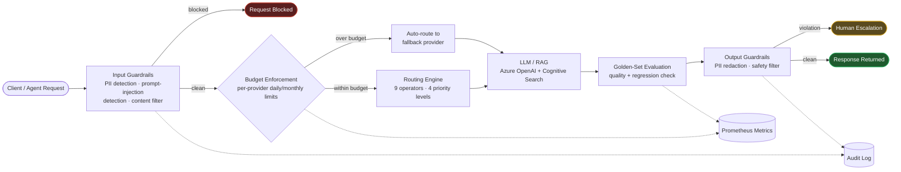

# Azure AI Infrastructure Platform

> **Note:** This platform was developed as internal infrastructure to support FXPE (Autonomous Multi-Agent Trading Platform) operations. It provides utilities AI workflows, RAG capabilities, and observability to power FXPE's internal operations and business processes.


## 🎯 **Production-Ready Azure AI Platform with Built-In Safety & Governance**

A unified RESTful API integrating Azure OpenAI (GPT-4), Azure Cognitive Search, and Azure Storage — with guardrails, budget enforcement, quality evaluation, and audit logging built into the request path itself, not bolted on after.

---

## **Value Proposition**

| Feature | What It Means |
|---------|---------------|
| **30+ API Endpoints** | Complete AI platform ready for integration |
| **Agentic Safety & Governance** | PII detection, prompt injection defense, budget enforcement, and audit trail on every request — see below |
| **6-Layer Security** | Enterprise-grade security (network, auth, API, data, application, monitoring) |
| **Real-Time Monitoring** | Prometheus + Grafana dashboards for production observability |
| **Production Deployment** | 4 deployment strategies (Container Apps, App Service, Docker, AKS) |
| **Semantic Search** | Azure Cognitive Search for RAG (Retrieval-Augmented Generation) |
| **Reference Workflows** | 4 end-to-end demo workflows built on the platform (utilities vertical) |

---

## 🛡️ **Agentic AI Safety & Governance**

Every request through this platform passes through the same governance path, whether it originates from a person, an FXPE agent, or an automated pipeline. Nothing reaches a model — and nothing reaches the caller — without going through it.



| Control | What it does | Where it lives |
|---|---|---|
| **PII detection & redaction** | Flags/redacts SSNs, emails, phone numbers, credit cards in both directions | `src/guardrails/`, `src/providers/guardrails/` |
| **Prompt injection defense** | 10 known attack patterns checked on every input | `src/providers/guardrails/detector.py` |
| **Harmful content filtering** | 13-keyword filter with block/redact modes | `src/guardrails/output_filter.py` |
| **Budget enforcement** | Per-provider daily/monthly spend limits, alerts, auto-routing on breach | `src/providers/budget/` |
| **Rate limiting** | Per-user, per-endpoint request caps | `src/guardrails/rate_limiter.py` |
| **Golden-set evaluation** | Regression detection between prompt versions before they ship | `src/providers/evaluation/` |
| **Audit trail** | Every guardrail decision and violation logged for review | `src/providers/guardrails/audit.py` |
| **Observability** | Prometheus metrics on requests, cost, latency, and violations | `src/monitoring/`, `src/providers/observability/` |

**Why this matters for agentic systems specifically:** an autonomous agent — unlike a human using a chat UI — can issue thousands of requests per hour with no one reviewing each one in real time. The failure mode isn't "a person types something bad," it's "an agent loop does something bad at scale before anyone notices." Budget enforcement bounds the financial blast radius; guardrails bound the content blast radius; the audit trail makes both reviewable after the fact. This is the same governance shape used to give FXPE's own agent fleet isolated execution boundaries.

**Honesty note:** guardrail detection here is deterministic (regex/keyword/pattern-based), not LLM-judged — that's a deliberate choice for speed and predictability at the gateway layer, not a limitation. It's not a substitute for a policy/legal review of agent behavior at scale.

---

## ⚡ **Reference Workflows** (Utilities Vertical)

Demo-mode reference implementations showing the platform applied to a concrete vertical. Anomaly-detection, comparison, and trend logic run for real against synthetic data today; extraction steps that depend on managed Azure AI services (e.g. Form Recognizer for bill OCR) are architected but not yet implemented — see [Reference Workflows Detail](docs/UTILITIES_USE_CASE.md) for current scope per workflow.

### **1. Bill Processing**
- Synthetic demo bill generation, validation, and anomaly detection (rule-based thresholds) — working today against demo data
- Automated PDF/Image extraction via Azure Form Recognizer — architected, not yet implemented (`extract_bill_data()` raises `NotImplementedError` outside demo mode, pending Form Recognizer credentials)
- Usage trend analysis and cost optimization recommendations

### **2. Regulation Search**
- RAG-based semantic search (Azure Cognitive Search)
- Compliance requirement extraction, AI-powered policy interpretation
- Compliance checklist generation

### **3. Support Automation**
- Automatic ticket classification (billing, outage, technical)
- Smart routing and priority assignment
- AI-generated response suggestions, sentiment analysis and escalation

### **4. Usage Analytics**
- Usage trend analysis and anomaly detection (demo dataset includes two seeded anomaly days used to validate the detection logic)
- Optimization recommendations, peer benchmarking, predictive insights

**Try it:**
```bash
uvicorn src.main:app --reload
curl http://localhost:8000/utilities/bills/demo
curl "http://localhost:8000/utilities/regulations/search?query=disconnection"
curl "http://localhost:8000/utilities/analytics/anomalies?customer_id=ACC-12345"
```
No Azure credentials required — the utilities module runs entirely against synthetic demo data. Core endpoints (`/chat`, `/rag`, `/guardrails`) call real Azure OpenAI / Cognitive Search clients and require real credentials.

**📘 [Full Reference Workflow Documentation](docs/UTILITIES_USE_CASE.md)**

---

## 🚀 **QUICK START (5 Minutes)**

### Option 1: Demo Mode (No Azure Required)

```bash
git clone https://github.com/syabdulr/Azure-AI-Infrastructure-Platform.git
cd Azure-AI-Infrastructure-Platform
python3 -m venv .venv
source .venv/bin/activate
pip install -r requirements.txt
uvicorn src.main:app --reload
```

**Access:** http://localhost:8000/docs

### Option 2: With Azure Credentials

```bash
cp .env.example .env
# Add your Azure credentials (see .env.example for details)
uvicorn src.main:app --reload
```

### Verify It Works

```bash
curl http://localhost:8000/health
curl http://localhost:8000/observability/metrics
curl http://localhost:8000/utilities/bills/demo
open http://localhost:8000/docs
```

---

## 🎨 **FEATURES OVERVIEW**

### AI & LLM
- ✅ Azure OpenAI Integration (GPT-4, Embeddings)
- ✅ Streaming responses for real-time chat
- ✅ Version-controlled prompt management
- ✅ Automated response quality evaluation

### Multi-Provider Gateway Engine
- ✅ **Response Normalization** — Adapter pattern for a unified response format; Azure OpenAI and OpenAI adapters implemented today, designed to extend to additional providers via `register_adapter()`
- ✅ **Multi-Provider Caching** — SQLite-backed response cache with TTL eviction and hit/miss metrics; 30-40% cost reduction is an industry-benchmark estimate, not yet measured against production traffic
- ✅ **Budget Enforcement** — Per-provider daily/monthly limits with alerts and auto-routing (currently in-process state; not yet coordinated across autoscaled replicas)
- ✅ **Custom Routing Rules** — 9 operators, 4 priority levels, dynamic rule engine with catch-all fallbacks
- ✅ **A/B Testing Framework** — MD5 deterministic assignment, traffic splitting, per-variant metrics
- ✅ **Observability** — GatewayMetrics, HealthSnapshot, hand-rolled Prometheus text-exposition export with per-provider breakdown

### Prompt Evaluation & Responsible AI
- ✅ **Golden Sets Evaluation** — Define expected outputs, automated quality scoring (exact match, keyword containment, term-frequency cosine similarity with Jaccard fallback for short strings, length ratio), regression detection between runs
- ✅ **Responsible AI Guardrails** — PII detection (SSN, email, phone, credit card), harmful content filtering (13 keywords), prompt injection detection (10 attack patterns), block/redact modes, human escalation, full audit trail — see [Agentic AI Safety & Governance](#-agentic-ai-safety--governance) above

### **RAG (Retrieval-Augmented Generation)**
- ✅ Azure Cognitive Search integration
- ✅ Semantic vector search
- ✅ Automatic document chunking & embedding
- ✅ Batch indexing for large document sets

### **Enterprise Security**
- ✅ PII detection & redaction (emails, phones, SSNs)
- ✅ Content safety filtering
- ✅ Rate limiting (per user, per endpoint)
- ✅ Input/output guardrails
- ✅ Comprehensive audit logging

### **Monitoring & Observability**
- ✅ Prometheus metrics (counters, gauges, histograms)
- ✅ Grafana datasource + dashboard-provisioning configured (auto-loads dashboards from a folder); dashboard JSON definitions not yet committed
- ✅ Structured JSON logging
- ✅ Multi-tier health checks
- ✅ Alert management with configurable rules

### **Production Deployment**
- ✅ Docker containerization
- ✅ Docker Compose for local development
- ✅ Azure Container Apps deployment
- ✅ Azure App Service deployment
- ✅ Azure Kubernetes Service (AKS) deployment
- ✅ CI/CD pipeline (GitHub Actions)

---

## 📸 **SCREENSHOTS**

### Swagger UI - Complete API Documentation


**30+ endpoints organized by 7 modules:**
- Health & Monitoring (5 endpoints)
- Chat & AI (2 endpoints)
- RAG (3 endpoints)
- Guardrails (8 endpoints)
- Prompt Management (8 endpoints)
- Observability (12 endpoints)
- **Utilities (17 endpoints)** 🔥

### Metrics Dashboard - Real-Time Monitoring


**Live metrics showing:**
- API request rate and latency
- AI request tracking (tokens, cost, latency)
- RAG query performance
- Guardrails violation tracking
- System resource usage

### Health Check - Multi-Tier Monitoring


**Comprehensive health monitoring:**
- Application status
- Azure OpenAI service health
- Cognitive Search connectivity
- Key Vault integration status
- Response time metrics

---

## 🏗️ **ARCHITECTURE**

### System Overview

```
Client → API Gateway → Guardrails → LLM/RAG → Output Filter → Client
                      ↓                   ↓
                 PII Detection      Azure Services
                      ↓                   ↓
                 Rate Limiting     Observability
```

### Key Components

| Layer | Components |
|-------|------------|
| **Application** | FastAPI, Uvicorn, Pydantic validation |
| **Business Logic** | LLM orchestrator, RAG processor, Safety manager, Utilities workflows |
| **Azure Services** | OpenAI (GPT-4), Cognitive Search, Storage, Key Vault |
| **Observability** | Prometheus, Grafana, Application Insights, structured logging |
| **Security** | PII detection, rate limiting, content filtering, audit logging |

**📘 [Full Architecture Documentation](docs/ARCHITECTURE.md)** - 40KB of detailed system design, security architecture, and scalability strategies

---

## 🚀 **DEPLOYMENT STRATEGIES**

### Production: Azure Container Apps (Recommended)
- Auto-scaling (2-10 replicas)
- Built-in load balancing
- Integration with Azure Key Vault
- **Estimated Cost:** $30-100/month

### Simplified: Azure App Service
- Easiest deployment
- Built-in monitoring
- **Estimated Cost:** $50-200/month

### Enterprise: Azure Kubernetes Service (AKS)
- Full Kubernetes control
- Advanced scaling
- High availability
- **Estimated Cost:** $100-500+/month

### Local: Docker Compose
- Perfect for development
- One-command startup
- Includes Prometheus + Grafana

**🚀 [Full Deployment Guide](docs/DEPLOYMENT.md)** - 15KB with step-by-step Azure deployment instructions, CI/CD setup, and troubleshooting

---

## 📊 **API ENDPOINTS**

### Utilities Module (17 Endpoints)

#### Bill Processing
- `GET /utilities/bills/demo` - Generate demo bill
- `POST /utilities/bills/analyze` - Analyze bill for anomalies
- `POST /utilities/bills/compare` - Compare two bills
- `GET /utilities/bills/anomalies` - Detect anomalies
- `GET /utilities/bills/trends` - Analyze usage trends

#### Regulation Search
- `GET /utilities/regulations/search` - Semantic search
- `GET /utilities/regulations/compliance-checklist` - Generate checklist
- `GET /utilities/regulations/interpret` - AI interpretation
- `GET /utilities/regulations/timeline` - Regulation timeline

#### Support Automation
- `POST /utilities/support/classify` - Classify ticket
- `POST /utilities/support/tickets` - Create ticket
- `GET /utilities/support/tickets/{ticket_id}` - Get ticket
- `PATCH /utilities/support/tickets/{ticket_id}/status` - Update status
- `GET /utilities/support/analytics` - Get analytics
- `GET /utilities/support/demo-tickets` - Get demo tickets

#### Usage Analytics
- `GET /utilities/analytics/usage-trends` - Analyze trends
- `GET /utilities/analytics/anomalies` - Detect anomalies
- `GET /utilities/analytics/recommendations` - Get recommendations
- `GET /utilities/analytics/peer-comparison` - Compare with peers
- `GET /utilities/analytics/report` - Generate report

#### Overview
- `GET /utilities/overview` - Module statistics
- `GET /utilities/` - Module information

### Core Platform (30+ Endpoints)

#### Health & Monitoring
- `GET /health` - Health check with dependency status
- `GET /health/live` - Liveness probe (Kubernetes)
- `GET /health/ready` - Readiness probe (Kubernetes)
- `GET /observability/metrics` - Application metrics
- `GET /observability/health` - Multi-tier health monitoring

#### Chat & AI
- `POST /chat` - Chat completion with Azure OpenAI GPT-4
- `POST /chat/stream` - Streaming chat completion for real-time responses

#### RAG
- `POST /rag/query` - Query documents with semantic search
- `POST /rag/index` - Index a document for retrieval
- `POST /rag/index/batch` - Batch index documents

#### Guardrails
- `POST /guardrails/check-input` - Check input for PII and safety
- `POST /guardrails/check-output` - Check output for safety compliance
- `GET /guardrails/limits/{user_id}` - Get rate limit status
- `GET /guardrails/violations` - List all violations

#### Prompt Management
- `GET /prompts/templates` - List all prompt templates
- `POST /prompts/evaluate` - Evaluate prompt response quality
- `POST /prompts/templates/{name}/set-active` - Activate prompt version

---

## 🧪 **TESTING & QUALITY**

### Test Results
- **Unit Tests:** 372/372 passing ✅
- **CI/CD:** GitHub Actions (flake8, black, isort, mypy, pytest, Docker build, Trivy scan, staging deploy) ✅

**Note:** Integration tests (API routes, LLM, RAG, Guardrails) would add 40-50% coverage but require Azure service credentials. Current coverage represents comprehensive unit testing of core components without external dependencies.

### Run Tests
```bash
pytest tests/unit/ -v
pytest tests/unit/ --cov=src --cov-report=html
open htmlcov/index.html
```

---

## 📚 **DOCUMENTATION**

| Document | Description | Size |
|----------|-------------|------|
| [Reference Workflows Detail](docs/UTILITIES_USE_CASE.md) | Utilities workflows, technical implementation | 17.9KB |
| [Architecture Guide](docs/ARCHITECTURE.md) | System design, security, scalability | 40KB |
| [Deployment Guide](docs/DEPLOYMENT.md) | Azure deployment strategies | 15KB |
| [Quick Start](docs/QUICK_START.md) | Fast-track deployment | 6KB |
| [Architecture Diagram](docs/ARCHITECTURE_DIAGRAM.md) | High-level architecture | 5.8KB |

**Total Documentation:** 78.9KB of professional, enterprise-grade documentation

---

## 🔒 **SECURITY FEATURES**

- **6-Layer Security Architecture**
  - Network: Azure Firewall, DDoS protection, WAF
  - Authentication: Azure AD, OAuth 2.0, RBAC
  - API: API keys, rate limiting, request validation
  - Data: Encryption at rest and in transit, TLS 1.3
  - Application: PII detection, content filtering, audit logging
  - Monitoring: Security monitoring, threat detection, incident response

- **Guardrails** — see [Agentic AI Safety & Governance](#-agentic-ai-safety--governance) above for the full request-path breakdown

- **Secrets Management**
  - Azure Key Vault integration
  - Secure credential storage
  - Automatic secret rotation

---

## 📁 **PROJECT STRUCTURE**

```
azure-ai-infra-platform/
├── src/
│   ├── api/              # API routes and schemas
│   ├── llm/              # LLM integration (OpenAI, prompts)
│   ├── rag/              # RAG implementation (Cognitive Search)
│   ├── guardrails/       # Platform-level input/output filtering for /chat, /rag — separate implementation from providers/guardrails below
│   ├── monitoring/       # Metrics, logging, alerts
│   ├── config/           # Configuration management
│   ├── utilities/        # Reference workflows (utilities vertical)
│   ├── providers/        # Multi-provider gateway engine
│   │   ├── normalization/  # Unified response format
│   │   ├── cache/          # SQLite multi-provider caching
│   │   ├── budget/         # Per-provider budget enforcement
│   │   ├── routing/        # Custom routing rules engine
│   │   ├── ab_testing/     # A/B testing framework
│   │   ├── observability/  # Prometheus metrics export
│   │   ├── evaluation/     # Golden sets prompt evaluation
│   │   └── guardrails/     # Gateway-scoped PII/safety detection with block/redact modes and an audit trail — distinct from top-level guardrails/
│   └── main.py           # FastAPI application
├── tests/                # 372 unit tests
├── docs/                 # Documentation (78.9KB)
├── docker/               # Docker configurations
├── .github/workflows/    # CI/CD pipelines
├── requirements.txt      # Python dependencies
└── README.md             # This file
```

---

## 🛠️ **TECHNOLOGY STACK**

| Category | Technology |
|----------|------------|
| **Application** | FastAPI, Python 3.11, Uvicorn, Pydantic |
| **Azure Services** | OpenAI (GPT-4), Cognitive Search, Storage, Key Vault, Container Apps |
| **Monitoring** | Prometheus, Grafana, Application Insights, Structlog |
| **DevOps** | Docker, GitHub Actions, pytest |
| **Security** | Azure Firewall, RBAC, TLS 1.3, Azure Key Vault |

---

## 💼 **PERFECT FOR**

- **Enterprise AI** — Production deployment at scale with guardrails, budget control, and full observability built in
- **Utilities, Healthcare, Finance** — Any domain that needs PII detection, audit logging, and compliance-grade traceability around AI workloads
- **Multi-Agent Systems** — A governed gateway for a fleet of agents that need bounded spend and reviewable behavior, not just a model endpoint

---

## 💰 **OPERATING COSTS**

| Scale | Azure OpenAI | Cognitive Search | Storage | Container Apps | Total |
|-------|--------------|------------------|---------|----------------|-------|
| Small | $50-100 | $25 | $5 | $30 | **$110-135** |
| Medium | $200-500 | $75 | $15 | $100 | **$390-690** |
| Large | $500-2,000 | $200 | $50 | $300 | **$1,050-2,550** |

---

## 🤝 **CONTRIBUTING**

Contributions are welcome! Please follow these steps:

1. Fork the repository
2. Create a feature branch (`git checkout -b feature/amazing-feature`)
3. Commit your changes (`git commit -m 'Add amazing feature'`)
4. Push to the branch (`git push origin feature/amazing-feature`)
5. Open a Pull Request

---

## 📝 **LICENSE**

This project is licensed under the MIT License - see the LICENSE file for details.

---

## 👨‍💻 **AUTHOR**

**Abdul Syed**  
GitHub: [syabdulr](https://github.com/syabdulr)  
Email: syabdulr6@gmail.com  
Role: AI Platform Engineer

**Focus:** Deploying and operationalizing AI workloads on Azure at scale, with safety and governance built into the gateway layer

---

## 🙏 **ACKNOWLEDGMENTS**

- Azure OpenAI Service
- Azure Cognitive Search
- FastAPI framework
- Prometheus ecosystem

---

**Built with ❤️ for production AI workloads on Azure** 🔥
